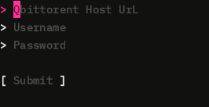
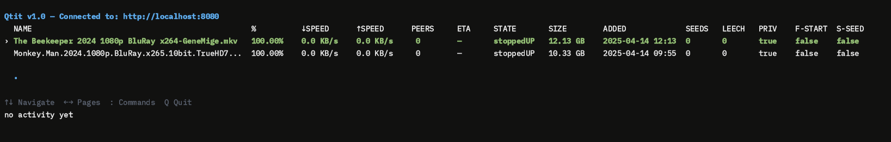
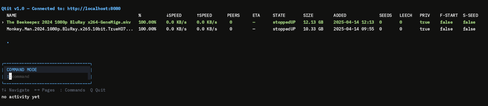

# 📦 Qtit – Terminal TUI for qBittorrent Seedboxes

Qtit is a interactive terminal UI for managing your qBittorrent client — especially handy for remote seedboxes. It offers real-time torrent status updates, keyboard navigation, and a powerful Vim-style command interface.


## ✨ Features

- 🚀 Real-time torrent updates (every 500ms)
- 🖥️ Full keyboard-based UI (Bubble Tea)
- 📜 Vim-style `:commands` to pause, resume, delete, recheck, or add torrents
- 📊 Clean, aligned torrent stats with paginator
- 🧠 Command feedback/status line
- 🧲 Add magnet links on the fly
- 🔐 Secure login via WebUI API session

---

## 🛠️ Installation

### Prerequisites

- Go 1.18+
- qBittorrent running with Web UI enabled

### Build for Linux

```bash
git clone https://github.com/yourname/qtit
cd qtit
go build -o qtit main.go
./qtit
```

---

## 🔐 Login Info

When you run the app, you'll be prompted to enter:

- qBittorrent Web URL (e.g. `http://127.0.0.1:8080`)
- Username
- Password

Qtit then creates a session and authenticates with the Web API.

---

## 🎮 Controls

| Key            | Action                         |
|----------------|--------------------------------|
| `↑ ↓`          | Move through torrents          |
| `← →`          | Change pages                   |
| `:`            | Enter command mode             |
| `q`            | Quit and logout                |
| `Enter`        | Submit command                 |
| `Esc`          | Cancel command mode            |

---

## ⚙️ Commands

Use `:` to enter any of the following:

| Command           | Action                           |
|-------------------|----------------------------------|
| `:start`          | Resume selected torrent          |
| `:stop`           | Pause selected torrent           |
| `:delete`         | Delete selected torrent (not files) |
| `:recheck`        | Force recheck selected torrent   |
| `:add <magnet>`   | Add a new torrent by magnet URL  |

---

## 🧪 Example

```bash
:add magnet:?xt=urn:btih:abcdef1234567890
```

---

## 🔭 Future Plans

- [ ] File list display for each torrent
- [ ] Torrent filtering (e.g. downloading/seeding only)
- [ ] File-by-file selection before adding
- [ ] Config saving (remember login and preferences)
- [ ] Command autocomplete (`:re → :recheck`)
- [ ] Dark/light color themes
- [ ] Bandwidth and ratio analytics
- [ ] Remote .torrent file upload

---

## 🧑‍💻 Built With

- [Bubble Tea](https://github.com/charmbracelet/bubbletea)
- [Bubbles](https://github.com/charmbracelet/bubbles)
- [Lipgloss](https://github.com/charmbracelet/lipgloss)
- Go standard libs: `net/http`, `cookiejar`, `encoding/json`

---



---



---



---


## 📄 License

MIT License – see [`LICENSE`](./LICENSE)
